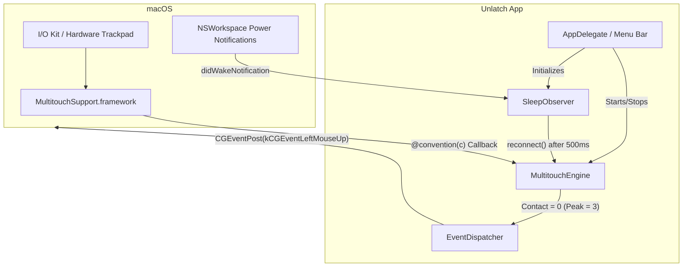

# Unlatch

A lightweight macOS menu bar utility for reducing the release delay after a three-finger drag.

## What it does

After performing a three-finger drag, macOS sometimes keeps the drag state active for a short moment after your fingers leave the trackpad. This makes drag-and-drop actions, selection rectangles, and quick follow-up clicks feel "stuck" or "velcroed" to your cursor. 

Unlatch monitors your trackpad contact counts using a low-overhead, high-performance listener. When a touch sequence peaks at exactly three fingers and then all fingers are released, it instantly posts a `leftMouseUp` event, freeing your cursor immediately. Built in Swift, Unlatch is highly optimized and automatically reconnects its hardware listeners when your Mac wakes up from sleep.

## Quick Start

### Prerequisites
- macOS 13.0 or later
- Xcode Command Line Tools (`xcode-select --install`) to compile the Swift source.

### Installation

1. **Clone the repository:**
   ```bash
   git clone https://github.com/xbeast1/Unlatch.git
   cd Unlatch
   ```

2. **Build the app:**
   ```bash
   ./build.sh
   ```
   *This compiles the Swift source files directly and outputs a signed `Unlatch.app` inside the `build/` directory.*

3. **Install and Run:**
   ```bash
   mv build/Unlatch.app /Applications/
   open /Applications/Unlatch.app
   ```

4. **Permissions:**
   Click the **Unlatch** menu bar item and choose `Request Accessibility Permission`. Enable it in **System Settings > Privacy & Security > Accessibility**. Quit and reopen the app if the permission does not apply immediately.

## Configuration Reference

Unlatch runs quietly in the menu bar. There are no environment variables or configuration files. The only configurable states are accessed via the menu bar drop-down:
- **Enabled**: Toggles the 3-finger drag release logic on or off without quitting the app.
- **Request Accessibility Permission**: Prompts the system to grant `AXIsProcessTrusted` access (required to post synthetic mouse events).

## Architecture Overview

Unlatch is built completely in Swift and uses `@convention(c)` closures to bridge to Apple's private C-based `MultitouchSupport` framework. 



- **`MultitouchEngine`**: The core FFI bridge that manages `dlopen`, `dlsym`, and thread-safe contact counting via `os_unfair_lock`.
- **`EventDispatcher`**: Synthesizes and dispatches `CGEvent` mouse clicks to the OS.
- **`SleepObserver`**: Listens for system sleep/wake notifications. It ensures the app doesn't break when you close your MacBook lid by automatically tearing down and re-registering the hardware callbacks 500ms after waking up.

## Development

### How to run locally
Because Unlatch does not use a bulky `.xcodeproj` file, development is simple:
1. Modify the Swift files inside `Sources/`.
2. Run `./build.sh` to compile.
3. Relaunch the newly built `Unlatch.app` from the `build/` directory.

### Code Constraints
- **Do not introduce memory allocations** (like Swift class allocations or large array appends) inside the `MultitouchEngine` hardware callback (`handleCallback`), as it fires hundreds of times per second on a background thread.
- **Thread Safety**: All state reads/writes inside `MultitouchEngine` must be protected by the internal `os_unfair_lock`.
